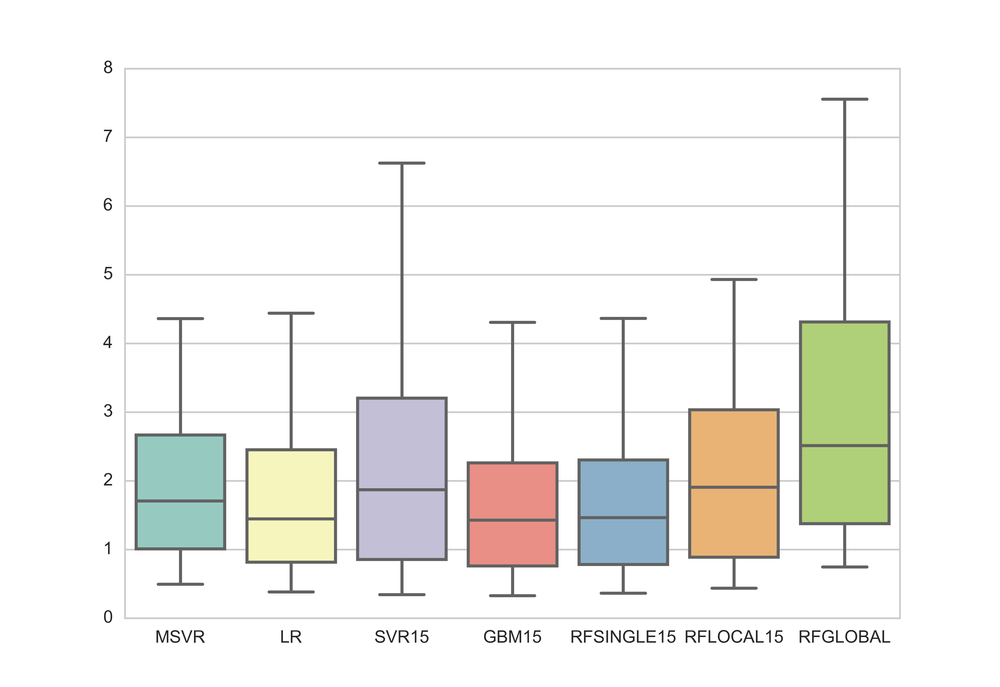

# Traffic Prediction

Evaluation of different machine learning methods for traffic prediction
> 3 month project for my master internship, done at VTTI, Virginia Tech Transportation Institude

## Technologies

The [Anaconda toolsuite](https://www.continuum.io/) has been used on Windows and Linux (the Linux machine was used for heavy computations). Specifically :
* **python 3.5**
* **pandas**, for data manipulation
* **scikit-learn**, for machine learning (regression algorithms like : SVR, Random Forest, Gradient Boosting)
* **matplotlib** and **seaborn**, for plots 

## Objectives

One personal goal was to put in practice what I learn through MOOC on machine learning with real *unclean* data. For the team, it was an opportunity to compare different algorithms and to evaluate Python vs Matlab.

## My approach

* analysis of the rough data (where I discovered *patterns* created by a previous data cleaning)
* ML implementation
* output analysis, where I checked which method performed better, with various metrics.


Since ML implies to play with parameters, each run of the algorithms comes along a *json* file describing all the setup :
* which data
* how the data was transformed (length of the time series, use of spatial correlation), predict all the network or street by street...
* setup for the ML method
``` json
{ 
	"datapath": "/home/cp/ML/data",
 	"location": "Chevire",
 	"horizon":[1,6],
 	"timeattr": true,
 	"corrmatrix": [false, 10],
 	"global": true,
 	"univariate": false,
 	"history": 5,
 	"methodname": "RandomForest",
 	"methodparam": [{
 		"n_estimators": 1500, 
 		"criterion": "mse",
 		"max_features": "auto",
 		"min_samples_split": 2
 		}]
}
```
The resulting analysis is illustrated by numerous graphs like :

showing the range of the predictions error.